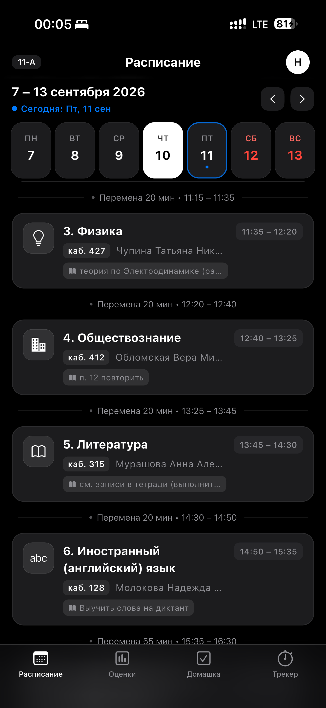
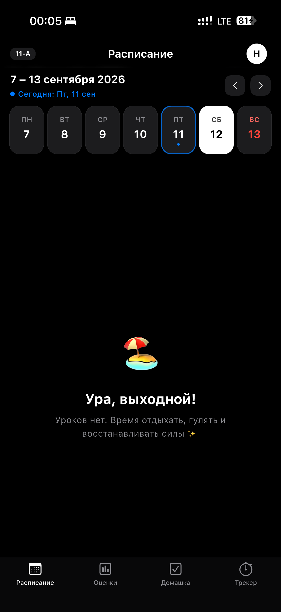
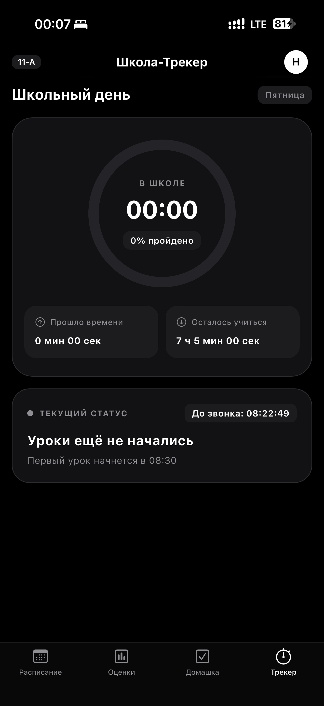

  

  # vSchool v2.0.0

  **Современный кроссплатформенный клиент МЭШ для iOS и Android**

  Быстрое, плавное и красивое приложение для школьников Москвы: расписание уроков, оценки, домашние задания и школьный трекер с эстетикой Apple Human Interface Guidelines, ProMotion-анимациями и Liquid Glass.

  
  
  
  

---

## 📱 Скриншоты интерфейса

  
  &nbsp;&nbsp;
  
  &nbsp;&nbsp;
  

---

## 🎥 Видеодемонстрация анимаций

В vSchool реализованы плавные пружинные анимации тактильного нажатия (`ProMotionBouncingCard`) и всплывающие модальные карточки уроков и домашних заданий (`ProMotionMorphRoute`):

> 📹 **[Смотреть видеозапись демонстрации интерфейса (MOV)](for_readme/ScreenRecording_09-11-2026%2000-04-53_1.mov)**

---

## ✨ Что нового в версии 2.0.0

- 🚀 **Полноценная кроссплатформенность:** Теперь приложение официально доступно как для **iPhone**, так и для **Android** с нативной иконкой, названием и единым безупречным визуальным стилем.
- 🎨 **100% визуальный паритет на Android:** Android-версия полностью повторяет дизайн iOS:
  - Док навигации **Liquid Glass Tab Bar** с размытием `BackdropFilter` (30px) и иконками `CupertinoIcons`.
  - Пружинные анимации всплывающих карточек уроков и домашних заданий с эффектом живого масштабирования.
  - Нативная система цветных бейджей оценок (`GradeBadge`).
  - Прозрачные системные бары (Edge-to-Edge) и поддержка жеста «Назад» (`PopScope`).
- 💎 **Обновленные бейджи оценок (Grade Badges):**
  - **5**: изумрудный `#4ADE80`, полупрозрачный фон `rgba(74, 222, 128, 0.15)`, тонкий бордер `rgba(74, 222, 128, 0.30)`
  - **4**: небесно-голубой `#38BDF8`, полупрозрачный фон `rgba(56, 189, 248, 0.15)`, бордер `rgba(56, 189, 248, 0.30)`
  - **3**: теплый янтарный `#FBBF24`, полупрозрачный фон `rgba(251, 191, 36, 0.15)`, бордер `rgba(251, 191, 36, 0.30)`
  - **2**: коралловый `#F87171`, полупрозрачный фон `rgba(248, 113, 113, 0.15)`, бордер `rgba(248, 113, 113, 0.30)`
  - Поддержка верхних индексов веса оценок (`²`, `³`, `⁴`, `⁵`).
- ⏱ **Таймлайн перемен:** Минималистичные разделители между уроками («Перемена X мин • XX:XX – XX:XX») в стиле Apple Calendar.

---

## 🔮 Планы на следующие обновления (Roadmap)

1. 🌊 **Liquid Glass везде на всех устройствах:**
   - Внедрение кастомных Impeller-шейдеров объемного размытия, бликов и рефракции Liquid Glass для всех карточек, списков и элементов управления как на iOS, так и на Android.
2. 💾 **Полноценный автономный оффлайн-режим (Offline Data Storage):**
   - В текущей версии при потере связи приложение выводит предупреждающее модальное окно с возможностью повторить запрос или открыть сессионный кэш.
   - В следующих релизах будет добавлена полноценная локальная база данных для надежного долговременного сохранения расписания, оценок и домашних заданий на диск, чтобы дневник мгновенно открывался и был доступен даже в авиарежиме или при плохом школьном интернете.

---

## 📲 Установка

### 🤖 Для Android
1. Перейдите в раздел **[Releases](https://github.com/PasyansPauk/vschool/releases/latest)**.
2. Скачайте файл **`vSchool-v2.0.0.apk`** (или `app-release.apk`).
3. Откройте скачанный файл на телефоне и подтвердите установку (разрешите установку из неизвестных источников в настройках браузера/файлового менеджера при необходимости).

---

### 🍏 Для iPhone (iOS)
Для установки на iOS скачайте файл **`vSchool-v2.0.0.ipa`** из раздела **[Releases](https://github.com/PasyansPauk/vschool/releases/latest)** и воспользуйтесь одним из удобных способов:

#### Способ 1 — Scarlet (без ПК, прямо на iPhone)
1. Откройте на iPhone сайт **[usescarlet.com](https://usescarlet.com)** и установите приложение Scarlet.
2. Подтвердите профиль: **Настройки → Основные → VPN и управление устройством → Доверять**.
3. Скачайте `vSchool-v2.0.0.ipa` через Safari.
4. В приложении Scarlet нажмите значок **+**, выберите скачанный `.ipa` и дождитесь установки.

#### Способ 2 — AltStore
1. Установите **AltServer** на компьютер с [altstore.io](https://altstore.io).
2. Подключите iPhone к компьютеру и установите AltStore на смартфон.
3. Откройте AltStore на iPhone → «My Apps» → **+** → выберите файл `vSchool-v2.0.0.ipa`.

#### Способ 3 — Sideloadly (через кабель)
1. Скачайте и запустите **Sideloadly** ([sideloadly.io](https://sideloadly.io)).
2. Подключите iPhone к компьютеру по проводу.
3. Перетащите файл `vSchool-v2.0.0.ipa` в окно Sideloadly, укажите Apple ID и нажмите **Start**.

#### Способ 4 — TrollStore (для поддерживаемых версий iOS)
1. Если на вашем устройстве установлен TrollStore, откройте файл `vSchool-v2.0.0.ipa` через меню «Поделиться» в TrollStore и нажмите **Install**.

---

## 🛠 Технологический стек

| Компонент | Технология |
|---|---|
| **Ядро и фреймворк** | Flutter 3.x / Dart SDK ^3.12.2 |
| **Интерфейс** | Cupertino Design System, Apple HIG Dark & Light |
| **Анимации** | Пружинные физические кривые (`Curves.easeOutCubic`, `Curves.easeOutBack`), кастомный морфинг `ProMotionMorphRoute` |
| **Шейдеры и размытие** | Impeller Engine, `BackdropFilter` (30px), `LiquidGlassWidgets` |
| **Авторизация** | Официальный вход через Мос.ID OAuth в изолированном WebView |
| **API** | Клиент взаимодействия с REST API Московской электронной школы |
| **Тактильность** | Системный виброотклик `HapticFeedback` |
| **Безопасность** | Локальное хранение токенов в защищенном хранилище без сторонних серверов |

---

## ⚠️ Дисклеймер

Приложение **vSchool** является независимым неофициальным проектом с открытым исходным кодом и не аффилировано с Департаментом образования и науки города Москвы, ГКУ «ЦЦО» или платформой «Московская электронная школа» (МЭШ). Все товарные знаки принадлежат их правообладателям.

---

## 📄 Лицензия

Проект распространяется под лицензией **MIT**. Подробности в файле [LICENSE](LICENSE).

  Создано с любовью к качественному UI для московских школьников ❤️

